# Resumen calidad

## Capítulo 2 - Causas que deterioran la calidad en el software

```
- Calidad de producto → Si le sirve a quien lo adquiere (y lo usa para lo que fue concebido)  
- Calidad de proceso → Un proceso malo genera productos de mala calidad
```

1. Lograr el involucramiento en el proyecto de parte de los clientes y usuarios
2. Lograr el compromiso de nuestra propia organización (somos los desarrolladores) con el proyecto
3. Lograr un claro entendimiento de los requerimientos
4. Lograr una planificación realista
5. Trabajaremos en forma iterativa
6. Evaluando objetivos
7. Capacitando a nuestros miembros
8. Motivando a todos los involucrados
9. Haciendo visibles los objetivos
10. Enfocándonos en generar valor agregado con cada entrega 

#### Problemas

- Falta de involucración del **cliente**
- Falta del compromiso de **organización desarrolladora**
- Falta de un claro entendimiento de los **requerimientos**

Calidad → Interna + Externa

- Necesidades del cliente → surgen desde el negocio
- Requerimientos → El técnico evalúa las **necesidades** y saca información de ellas para transformar las necesidades en requerimientos → Se pueden medir → Pruebas de aceptación

```
Vista → Externa → Encuestas clientes
                → Pruebas de aceptación
          
      → Interna → Calidad de diseño
                → Calidad de código
                → Métricas
```

**Mejora continua** → Todo el tiempo buscar el punto de mejorar y hacer ciclos de revisión y mejora continua.

## Capítulo 3 - Trabajo con la organización - Mejora de procesos

### 3.1 Visión del cambio

#### ¿Cuáles son las causas por las cuales los responsables de las organizaciones deciden embarcarse en un proceso de mejora?

- Trabajar de una mejor manera para generar un ambiente de trabajo más valorado por sus miembros y captar así a los mejores profesionales al convertir a la empresa en un lugar deseado.
- Mejorar los procesos de desarrollo para mejorar la calidad de los productos generados y hacer a la empresa más competitiva, y como consecuencia de esto ganar una porción mayor del mercado.
- Ser beneficiados por incentivos legales instituidos por políticas públicas y lograr beneficios impositivos que favorezcan las finanzas de la organización. 


#### Preguntas que hay que hacerse

- **¿Qué hay que cambiar? → Evaluar la situación** ← Falta de consenso → Listar los problemas de la organización sin causas ni responsables.
- **¿Hacia dónde debe conducir el cambio? → Visión, estrategia, tácticas y buenos prácticas** ← Falta de consenso sobre la dirección, que funcione la solución, efectos no deseados → Listado de alternativas de cambio a los problemas, generar espacio de opinión
- **¿Cómo implementar el cambio? → Desarrollo de tácticas y planes, sincronización de esfuerzos, planeamiento y liderazgo** ← Falta de una clara visión, falta de confianza → Depende de la planificación técnica y de los recursos que se cuente

### 3.2 Trabajando en los cambios

#### Modelo IDEAL


Inicio → Diagnostico → Planificar → Actuar → Aprender

#### Modelo EOALG → Escuchar y observar a la gente

Presentar → EO → Compartir → EO → Inducir → EO → Guiar → EO → Evaluar → EO → Acomodar y cambiar → Comunicar

#### Fenómenos 

→ **Desconcierto** → Punto de inflexión en el cambio, se necesita apoyo para superarlo, sino se vuelve a la forma original, mala pero segura. Sugiere realización de proyectos piloto.  
→ **Proceso virtual** → Punto medio entre el proceso real y el nuevo proceso, producto de la dilatación en la implementación

### 3.3 Aspectos y factores del Proceso de mejoras

#### Direcciones del cambio

- Tácito → Explícito → Conocimiento privado en lugar de organizacional
- Informal → Formal → Habilidades particulares
- Episódico → Sustentable → Por algo particular en vez de buenas formas
- Individual → Organizacional → Capacitación personal en lugar del entorno
- Intuitivo → Empírico → Decisión por experiencia individual en lugar de la organización
- Cualitativo → Cuantitativo → Análisis informal en lugar de métricas
- Táctico → Estratégico → Planificar para hoy en lugar de a más largo plazo

#### Aspecto socio-cultural de la gestión del cambio

- Incrementar la capacidad de los empleados y de la organización.
- Asegurar que la calidad sea un atributo organizacional.
- Alinear los intereses de los individuos con los de la organización.
- Retener recursos humanos y conocimiento críticos para la organización.

#### Factores críticos y de riesgo

- Procesos previos de mejora fracasados → +esfuerzo
- Recursos financieros disponibles → +esfuerzo, no factibilidad
- Recursos humanos dedicados al proceso → Son necesarios
- Capacidad de ingeniería de software → -conocimiento +capacitación
- Disponibilidad de soporte técnico → Es necesario
- Obligaciones contractuales → Condicionan las pruebas piloto
- Alcance de la intervención → +claro -confusión
- Cultura de la organización → Condiciona el proyecto
- Estándares de la industria y la organización → Condiciona el proyecto
- Comprensión y apoyo de todos los niveles de gerencia y desarrollo. → Sin gerencia, no comenzar
- Presión política de la corporación → +Planificación realista, no ceder
- Objetivos de negocio → Hay que tenerlos en cuenta, visión 
- Visión → Preguntarse ¿Por qué? para descubrirla y darle forma

#### Factores generales de éxito

- Expectativas realistas → Evita pasarse del alcance
- Apoyo de la gerencia → Compromiso y soporte
- Necesidades y expectativas gerenciales, y la comprensión del problema → Facilita y evita conflictos
- Grupo de Ingeniería de Procesos de Software (con un “campeón” del cambio). → Ámbito donde se general los cambios
- Comenzar poco después de una evaluación → Evita procesos virtuales
- Capacitar a todos de los nuevos procesos → Esencial
- Gestión de la dimensión humana → Evita el rechazo
- Selección cuidadosa de proyectos piloto → No afectar proyectos críticos que culpen a la mejora
- Auditorías de proceso en la implementación → Corregir y acompañar
- Encuestas de efectividad de los equipos de trabajo → Retroalimentación
- Comenzar con los ajustes gerenciales más altos → Genera confianza
- Tener acompañamiento de expertos en cambio organizacional → En general no hay
- Mejoras y objetivos de negocios cerca  →  Logra aprobación de marketing y comercial
- Vocabulario compartido → Identidad al proceso de cambio

#### Factores de éxito en PYMES
 
- Adaptarse a las características de la empresa → Si no es acorde, fracasa
- Facilitar el aprendizaje horizontal con la experiencia de otras pequeñas empresas → Potencia recursos, aprovecha esfuerzos
- Necesidad de acompañamiento → No afectar los procesos actuales por falta de personal
- Claridad en el financiamiento → Tener claro el alcance financiero

#### Recomendaciones

- No buscar una certificación como un fin sino como consecuencia
- Compromiso total con la objetividad, la racionalidad y el aprendizaje
- Adecuarse a las características de la empresa (tamaño, cultura, estructura, tipo de negocio)
- Encuadrar la estrategia global de negocios
- Acompañamiento como apoyo a la gestión de cambio y riesgo incremental 

### 3.4 Gestión del cambio

#### Oposición al cambio → Emergentes, positivos

- Las organizaciones están compuestas por personas, por lo tanto son organizaciones vivas.
- Los seres vivos no cambian, reaccionan.
- Detectar los emergentes en estas reacciones e interpretar su visión.
- Alinear los intereses emergentes con los del proceso de cambio. 

#### Cultura organizacional

Estructura → Claves → Objetivos → Comportamiento ante cambios → Ejemplo

- **Jerárquica** → Reglas y rutinas formales → Estabilidad y control → Cumplimiento de procedimientos → Resistencia status quo → Estructura militar, desarrollo con mezcla de tareas operativas y de desarrollo
- **Racionalista** → Basada en la capacitación → Productividad y eficiencia → Seguimiento de objetivos → Abierta a cambios por objetivos → Software factory, modelo CMMi
- **Consensual** → Basada en la colaboración grupal  → Cohesión y moral  →  Mantenimiento del grupo → Abierta a cambios → Org. no gubernamentales sin fines de lucro (fuera de SW)
- **Desarrollo Humano** → Basada en la colaboración grupal → Flexibilidad, centrado en la gente → Crecimiento y desarrollo de los miembros → Cambios naturales → Comunidades científicas

#### Estrategia

- Acordar visión y objetivos con la autoridad  → sin ella es imposible dar directivas
- Crear canales de comunicación y comunicar
- Detectar liderazgo y alinear con el cambio
- Convertir la reacción en Emergentes y utilizarla en la Planificación
- Detectar problemas, que cambiar y como implementar cambios

#### Tácticas

- Detectar agentes de cambio y trabajar con ellos
- Seleccionar temas puntuales. Trabajar en forma incremental
- Rescatar lo bueno, bien hecho y conservarlo como parte de la mejora
- Fundamentar los cambios y mostrar resultados con frecuencia

#### Liderazgo

- Un lider no es aquel que enseña, sino que muestra el camino sin saberlo y motiva
- Una organización necesita líderes en todas sus áreas
- Debe formar parte de la cultura la delegación 
- Debe formar parte de la cultura la asunción de responsabilidades

## Capítulo 4 - Trabajo con requerimientos

### 4.1 Importancia de los requerimientos

#### Rol del analista

Doble interfaz

- **Interfaz de Negocio**  → técnicas de relevamiento, UML (actividad, estado y secuencia) y documentación de proceso de negocio
- **Interfaz de Desarrollo**  → interfaz entre clientes y usuarios al grupo de desarrollo, UML (clases, casos de uso y paquetes), modelo de dominio y arquitectura de sistemas

#### ¿Qué son los requerimientos?

- Definen lo que un sistema permite hacer desde el punto de vista del usuario
(funcionales)
- Definen condiciones de funcionamiento del sistema en el ambiente operacional (no funcionales)
- Definen las condiciones a cumplir durante el desarrollo (de proceso).

Definir el sistema a desarrollar → Comunicar y acordar el alcance y las prioridades → Planear el proyecto de desarrollo

Los requerimientos deben describir el sistema que los clientes y usuarios necesitan, por eso hay que **_validarlos_**.

### 4.2 Tareas asociadas a los requerimientos

#### Foco


- La visión del proyecto **(por qué)**
- La inclusión del vínculo de todos los involucrados en el negocio **(quién)**
- El alcance del sistema a desarrollar **(qué)**
- Las condiciones del ambiente operacional **(dónde)**
- El comportamiento funcional esperado **(cómo)**
- Los eventos del negocio **(cuándo)**

#### Nivel

Determina el detalle que son tratados los aspectos. Depende del ciclo de vida

#### Vista

Depende de los modelos que se utilicen

- Estructura (modelo de dominio)
- Dinámica (diagramas de secuencia)
- Comportamiento (diagramas de casos de uso)
- Control (reglas de negocio, modelo de análisis)

**Es fundamental relevar los requerimientos desde los distintos enfoques (FOCO) construyendo los distintos modelos (VISTAS) y trabajando según el ciclo de vida del proyecto (NIVEL).**

### 4.3 Estrategia y tácticas en el trabajo con requerimientos

#### Estrategia

Planear → Hacer → Revisar → Corregir

#### Tácticas

Los requerimientos deben cumplir con

- Completitud
- Correctitud
- No ambigüedad

#### Casos de uso

Describe la dinámica entre un actor y como responde el sistema


### 4.4 Análisis de requerimientos

#### Dominio y Negocio vs Diseño

→ Objetivo → Mecanismo utilizado

**Modelo de Negocio** → Entender en detalle el negocio y sus reglas → Patrones de análisis

**Diseño** → Implementar una solución al problema planteado en el análisis más las restricciones impuestas por los requerimientos no funcionales → Patrones de diseño

### 4.5 Validación y Verificación

**Validación** → Programación definitivo o prototipo y ejecutar las validaciones de las reglas de negocio. Validación del comportamiento de la aplicación con los usuarios según caso de uso.

**Verificación** → Diseño y ejecución de pruebas (test) que darán la certeza que hemos construido el sistema de manera correcta. 

### 4.6 Administración de cambios a los requerimientos

- Gestionar los cambios
- Que tratamientos les daremos a esos cambios

#### 4.7 Conclusiones

De lo expuesto se concluye que el trabajo con los requerimientos es mucho más que relevar y listar los “el sistema debe...” de todo proyecto de desarrollo.

Es de primera importancia planificar el trabajo con los requerimientos.

Es fundamental relevar los requerimientos desde los diferentes enfoques (Foco), construyendo los diferentes modelos (Vistas) y trabajando según el momento del ciclo de vida del proyecto (Nivel).

Es necesario que el listado cuente con determinadas propiedades (detallado, atómico, completo, correcto, no ambiguo) para no ser solo un listado de características.

Se debe, a partir de la especificación del comportamiento de la aplicación a desarrollar (casos de uso), definir cómo se implementarán estos requerimientos.

Es necesario contar con un modelo de dominio que siente las bases para un posterior diseño y que esencialmente describa al negocio.

En todos los casos, administrar los cambios surgidos durante el proceso de desarrollo.

Por último debemos validar y verificar todo este trabajo con los requerimientos.

## 5. Trabajo con la gestión de proyectos

### 5.1 Proyectos


### 5.2 Planificación de proyectos

#### Estrategia

Metodología no es estrategia

- Logro de objetivos
- Implementar los requerimientos priorizados
- Orientada a evitar/sobrepasar los obstáculos (riesgos)

- Objetivos a partir de la visión → Financiera, cliente usuarios
- Conocer los riesgos → Detectarlos, gestión
- Entender la solución y alcance → Requerimientos, Listar/priorizar casos de uso
- Estimar → Casos de uso, interfaces con sistemas externos, Reportes
- Definir procesos → Metodología, Roles
- Cronograma priorizado -> Hitos, relaciones

#### Riesgos

- **Requerimientos** → Complejidad y falta de disponibilidad
- **Tecnología** → Falta de experiencia o madurez
- **Organización** →  Falta de apoyo de la gerencia
- **Cliente** → Falta de experiencia en proyectos de desarrollo
- **Grupos de desarrollo** → Grupos nuevos sin trabajos anteriores

#### Estimaciones

De alcance y esfuerzo

- Las estimaciones teóricas deben ser ajustadas a la realidad del proyecto
- Las planificaciones no pueden acortarse sumando gente a los proyecto

#### Metodologías ágiles vs conducida por los planes

- Chrystal
- Xtreme Programming

- **Ágiles**: Basan su esecnia en maximizar la producción
- **Guiadas por los planes**: Se basan en el gasto operativo

**¿Cómo elegimos la metodología para el proyecto?**

- **Conducida por los gastos**: Gasto operativo → Inventario → Producción
- **Conducida por producción**: Producción → Inventario → Gasto operacional (← Foco)
- **Conducida por los planes**: Alcance → Presupuesto → Duración
- **Ágiles**: Duración → Presupuesto → Alcance (→ Grados de libertad)

```
Ágiles ←------------------------------→ Conducida por los planes
            -  Dominio maduro  +
            -  Complejidad  +
            -  Proceso Instalado  +
            +  Capacidad desarrolladores  -
            +  cliente colaborativo  -
```

### 5.3 Seguimiento del desarrollo de proyectos

#### Líder de proyecto

1. Generar en tiempo y forma los eventos planificados
2. Facilitar los acuerdos necesarios
3. Tomar decisiones

**Sí**

- Cohesión en el grupo
- Necesidades personales
- Facilitar la planificación
- Decisiones apoyado en referentes técnicos
- Informado y actualizado sobre la tecnología
- Tomar decisión en caso de desacuerdo
- Motivar y comprometer a los usuarios y clientes
- Escalar problemas

**No**

- Competir
- Ignorar tecnología
- Desatender el proyecto por cuestiones corporativas
- Olvidar que los desarrolladores son lo + importante
- Olvidar que hay que entregar un producto funcionado
- Temer parar cuando la factibilidad esté cuestionada

#### Puntos de observación

Para informar el estado y avance y tomar decisiones al respecto.

Fotos versus película
→ Tratamiento de una decena de tema
→ No seguimiento de los temas tratados

#### Escalamiento

- Roles predefinidos y asumidos
- Gerentes muy bien informados acerco de los proyectos

#### Métricas

- Progreso acumulado vs Cronograma, iteraciones → Al variar las correcciones y los requerimientos, creciendo y luego decreciendo, es un indicador de la evolución **estable** del proyecto.
- Relación entre errores detectados y corregidos


Otro grupo: GQM (Goal-Question-Metric). Preguntas al negocio para obtener una métrica 

Distintas métricas según fase

- Adherencia → Incorporación y cumplimiento de procesos y procedimientos
- Estabilidad → Para tomar acciones aque ayuden a mantenerla
- Capacidad → Una Cubrimiento de los objetivos
- Comportamiento → Eficiencia y eficacia
- Mejora → Para mejora continua

### 5.4 Conclusión

A efectos de lograr una buena gestión de los proyectos de desarrollo de software de forma que generen productos de calidad se debe:

- Elaborar una estrategia en base a los objetivos, prioridades y riesgos
- Volcar en una planificación los esfuerzos estimados según la estrategia
- Realizar el seguimiento resolviendo los problemas que se generen y escalando los que excedan nuestras responsabilidades
- Detenerse ante los problemas y no continuar hasta resolverlos
- Explicar cada decisión y comunicarla a todos los involucrados
- Tomar métricas que nos provean indicadores de la evolución de los proyectos de alineados a los objetivos del negocio y a los procesos de nidos para la organización

## Capítulo 6 - Trabajo con la Implementación. Diseño, codificación y pruebas

### 6.1 Diseño, codificación y pruebas

**Problemas**

- Proceso de Diseño → Revisión de los diseños con pares y otros miembros. Búsqueda de que revisar
- Construcción → Pruebas unitarios y de integración es costosa. Buscar automatización, también búsqueda de que revisar
- Pruebas → Realizar pruebas no contribuye a la mejora de calidad, sino solo a detectar errores, se necesita una acción constructiva global

### 6.2 Pruebas de software

Cambiar la forma de trabajo con pruebas porque:

- El ciclo de prueba manual es muy largo
- El proceso de prueba manual es propenso a errores
- Liberar a la gente para realizar tareas creativas
- Generar un ambiente de confianza soportado por los test
- Obtener realimentación de forma temprana y con alta frecuencia
- Generar conocimiento del sistema en desarrollo a partir de los test
- Generar documentación consistente del código
- Generar una mejor utilización de los recursos a partir de menores costos
- Desarrollar un criterio de diseño basado en las pruebas

**Necesitamos**

- Automatizar y sistematizar las pruebas
- Desarrollar un criterio de diseño basado en las pruebas

#### Repositorio

- Haga commit con frecuencia
- Construya binarios con cada cambio
- No tome del repositorio (checkout) a su estación de trabajo código no funciona
- Escriba test unitarios sistemáticos para el código que desarrolla
- Antes de subir al repositorio (check in) el código desarrollado y todos los tests (suyos y los de los otros desarrolladores) deben ser ejecutados con éxito
- Corrija los errores (tests sin funcionar) que su código generó en forma inmediata

#### Automatización

`JUnit (y familia xUnit)`

- Mejorar la calidad del software
- Entender el SUT (System Under Test)
- Reducir los riesgos
- Tests fáciles de ejecutar
- Tests fáciles de escribir y mantener, si es posible en el mismo lenguaje en que los desarrolladores programan el sistema
- Tests con mínimo mantenimiento ante evolución del sistema

- **La facilidad de ejecución está directamente ligada** a la constante ejecución de los test.
- **La mejora de la calidad se produce por** la incorporación en etapas tempranas de los programadores al proceso de pruebas

**¿Qué debe automatizarse?**

- Pruebas unitarias y de componentes
- Pruebas de funcionalidad sin interfaz de usuario
- Pruebas de sistema con interfaces de usuario

**Ambiente de pruebas**

Adelantar las tareas que tienen que ver con las pruebas
  → Generar un ***Criterio de diseño basado en las pruebas*** (Hacerlo en la etapa de diseño)

Los tests deben ser:
- **Atómicos**
- **Independientes**
- **Repetibles**
- Criterio de diseño basado en las pruebas

**Estrategia**

- Capacitación a analistas, testers y programadores
- Seleccionar una forma de trabajo
- Seleccionar herramientas
- Desarrollar proyectos pilotos
- Institucionalizar

### 6.3 Integración continua

1. Commit
2. IC detecta cambio, hace un build, ejecuta tests, toma métricas y elabora informes.
3. IC envía mail al grupo de desarrollo
4. IC continua monitoreando para cambios

### 6.4 Revisiones de diseño y código

Revisiones por pares y/o especialistas. (Ayuda a detectar errores)

- **Formales**: Con roles y responsabilidades, y un procedimiento de nido.
- **Informales**: Con roles desdibujados y sin procedimiento.

**Objetivos**

1. Detectar problemas de análisis, diseño y código en forma temprana 
2. Definir y acordar criterios de retrabajo para su resolución
3. Verificar que se resolvió de acuerdo al criterio acordad

**Beneficios**

1. Genera datos acerca del producto y del proceso de desarrollo
2. Genera conocimiento entre miembros del grupo de desarrollo
3. Aumenta la efectividad de la validación y verificación
4. Contribuye a la instalación del concepto de calidad

### 6.5 Conclusiones

La preocupación que expresamos en el comienzo del capítulo fue conocer, en cada momento de las iteraciones de la construcción de un sistema en desarrollo, el estado actualizado de los productos generados por el proyecto.

Cuestionamos las especulaciones que generalmente se utilizan para dar una respuesta certera a esta pregunta y para ello promovimos la utilización de un repositorio de código fuente con ciertas reglas de uso, la sistematización y automatización de las pruebas, la integración continua por parte de un servidor destinado a tal fin y la revisiones de productos conducidas por métricas obtenidas de los informes de resultados.

En definitiva, buenas prácticas orientadas a garantizar la calidad de los productos de los proyectos organizando y controlando la logística.

## Capítulo 7 - Trabajo con Modelos de Desarrollo - CMMI

Modelo de **capacidad** (6 niveles) y **madurez** (5 niveles)

- **Capacidad** → Qué tan bien se desempeña la organización en un *área de proceso* individual
- **Madurez** → Cómo se desempeña la organización en base a la madurez en un *conjunto de áreas de proceso*

El modelo está compuesto por los siguientes componentes: **objetivos, prácticas y subprácticas**.

- **Objetivos → componentes requeridos** → específicos, por área de proceso, y genéricos, relacionados a la institucionalización
- **Prácticas → esperadas** Si se alcanzaron los objetivos, también específicas y genéricas
- **Subprácticas → componentes informativos** → Interpretación e implementación de trabajo. Activos de trabajo y distintas disciplinas.

**Áreas**

- REQM - Requirements Management - Requerimientos
- PP - Project Planning - Planificación
- PMC -Project Monitoring and Control  - Monitoreo y control
- SAM - Supplier Agreement Management - Proveedores
- MA - Measurement and Analysis - Métricas
- PPQA - Process and Product Quality Assurance - QA
- CM - Configuration Management - Configuración

**CL2. Proceso administrado**

- GP 2.1 Establish an Organizational Policy 
- GP 2.2 Plan the Process
- GP 2.3 Provide Resources
- GP 2.4 Assign Responsibility
- GP 2.5 Train People
- GP 2.6 Manage Configurations
- GP 2.7 Identify and Involve Relevant Stakeholders
- GP 2.8 Monitor and Control the Process
- GP 2.9 Objectively Evaluate Adherence
- GP 2.10 Review Status with Higher Level Management

### Tablas

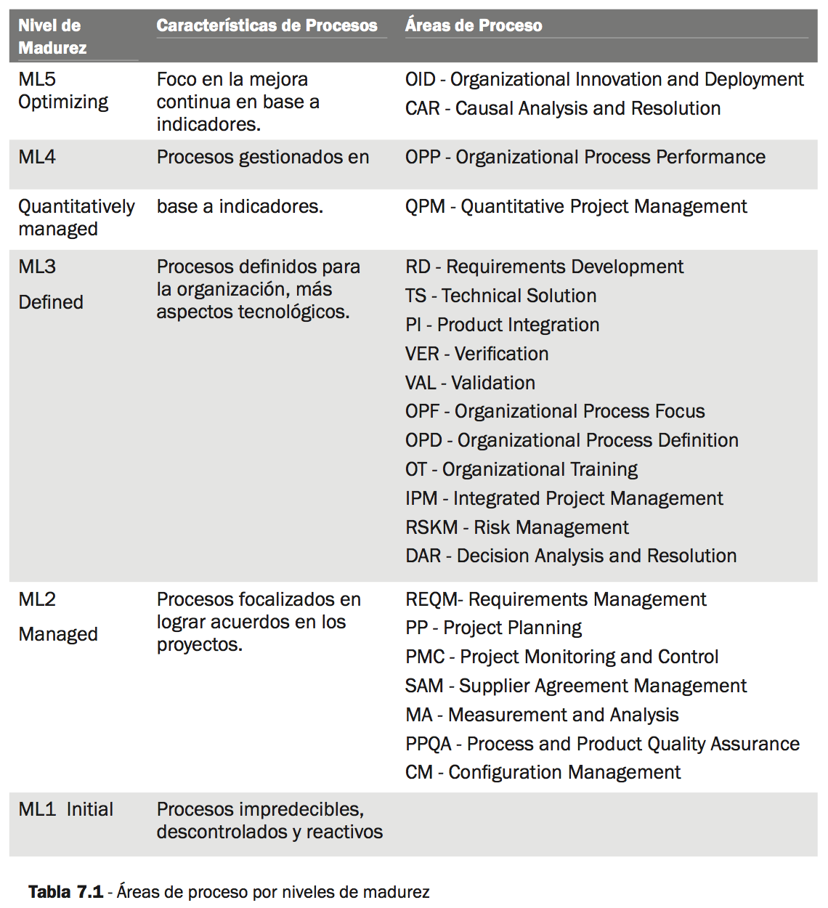
<br><br><br>
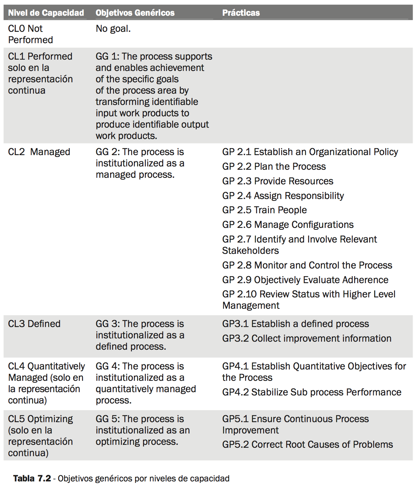
<br><br><br>
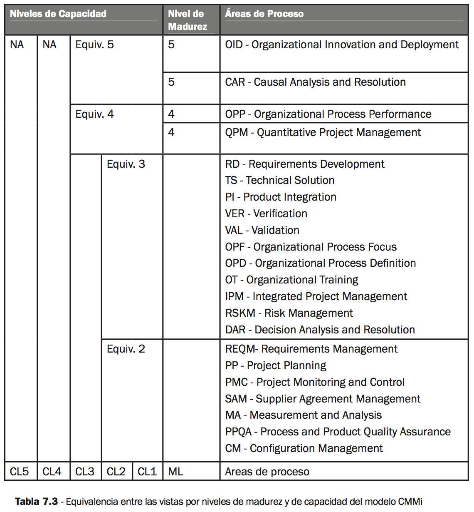
<br><br><br>
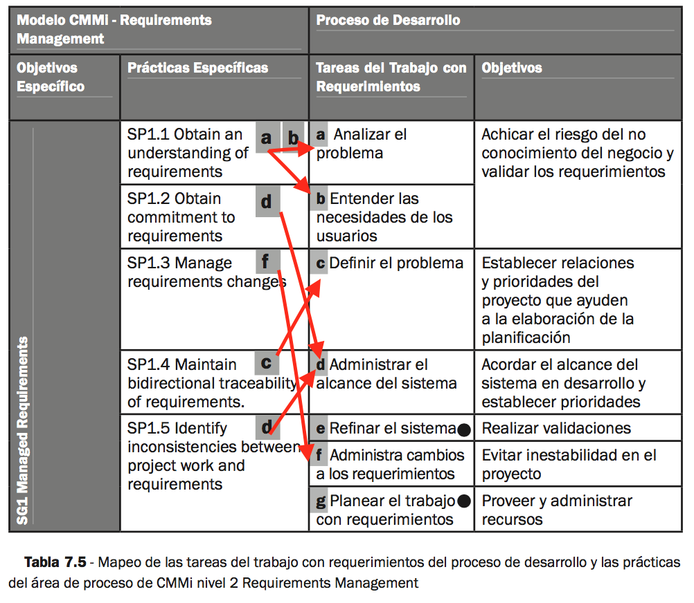

**Activos o productos de trabajo:**

- **ERS** (Especificación de Requerimientos de Software)
- **Procedimiento de especificación de requerimientos** (orientado a la construcción de la ERS)

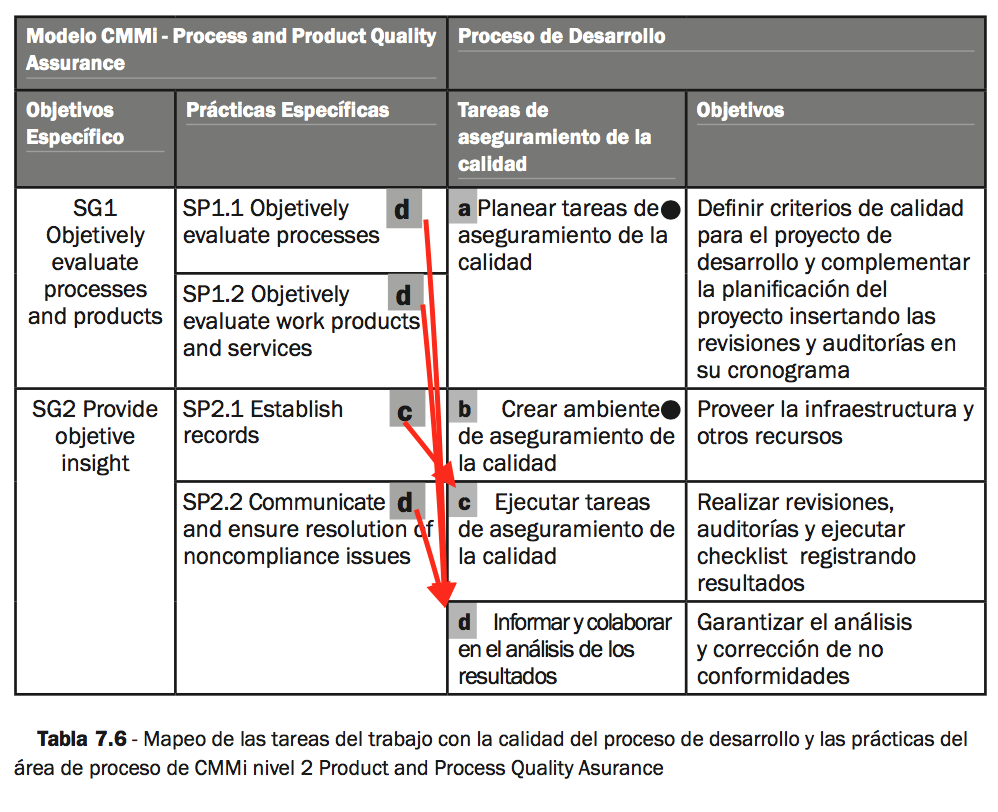

**Activos o productos de trabajo:**

- **Procedimientos**
    + Planear aseguramiento de la calidad
    + Crear ambiente de aseguramiento de la calidad
    + Ejecutar tareas de aseguramiento de la calidad
- **Activos**
    + Plan de aseguramiento de la calidad.
    + Estándares de programación.
    + Matriz de seguimiento de no conformidades.
- **Checklists de procesos**
    + Fase Preventa
    + Fase Concepción
    + Fase Elaboración
    + Fase Construcción
    + Fase Transferencia
    + Proceso de aseguramiento de la calidad (PPQA)
    + Administración de la configuración
    + Implementación de medidas y análisis
    + Administración de proveedores
    + Iteración
- **Checklists de productos**
    + ERS
    + Plan de Proyecto
    + Plan de QA (Aseguramiento de la calidad)
    + Plan de CM (Administración de la configuración)
    + Plan de MA (Medidas y análisis)
    + Cronograma del proyecto
    + Plan de Iteración

### Estrategia

- Relevamiento de la empresa, generar documento de relevamiento, exponer a todos los miembros el resultado (con fortalezas y debilidades)
- Elaborar plan de mejora (incluye cronograma), asignar un impulsor, ejecutarlo en forma continua (dedicación parcial de los miembros) e informando en reuniones de exposición los resultados del trabajo
- Armar un proyecto piloto
- Tener un grupo impulsor responsable (EPG - Engineering process group)
- Ponerlo en práctica en todos los otros proyectos

**IDEAL con proyecto Piloto**

- **Inicio** → comenzar con la aplicación de un SCAMPi Informal, adaptado a la empresa
- **Diseño** → (Basado en FODA encontrados en el SCAMPi) Se escriben las políticas, los procesos y procedimientos y estándares y se definen métricas a utilizar. Se define el EPG (ver arriba).
- **Piloto** → Se prueban los procedimientos en algunas áreas de proceso, adaptándolos
- **Implementación** → Se extendiendo a todos los proyectos de la organización y se mide su efectividad

### SCAMPi

Proceso de evaluación.

Conjunto estructurado de actividades como entrevistas, revisión de documentación, presentaciones y análisis de respuestas a cuestionarios.

### 7.5 Conclusiones

- Entender las necesidades de la organización y realizar un análisis de factibilidad del proyecto asociado a las mejoras utilizando CMMi.
- Confirmar el compromiso de los dirigentes de la organización para con el proyecto en forma periódica.
- Adaptar el modelo a la realidad de la organización.
- Administrar los cambios como se trató en el capítulo tres.
- Hacer planificaciones realistas basadas en el gap analisis.
- Rescatar todo lo bueno instalado en la organización previamente al inicio de la mejora de procesos.
- Seleccionar cuidadosamente a los mentores.
- Disponer y asignar los recursos materiales y humanos necesarios.
- Dar contenido a las subprácticas ya que estas representan las actividades diarias de los miembros de la organización para inducir a la adherencia al modelo.
- Trabajar hasta alcanzar un grado de madurez que facilite la perdurabilidad en el tiempo de las mejoras logradas.

## ITIL

Buenas prácticas de adm. de tecnología informática

**Objetivos**

- Alinear los servicios de tecnología con la evolución del negocio
- Optimizar la calidad de los servicios de tecnología prestados.
- Reducir los costos

**Fases**

1. Servicio de Estrategia
2. Servicio de Diseño
3. Servicio de Transición
4. Servicio de Operación
5. Mejora continua

### 1. Fase estrategia

***Desde la perspectiva de un responsable de IT de una organización*** ¿Qué se debe tener en cuenta al momento de fijar una estrategia para la prestación de servicios?

**Gobierno y toma de decisiones**

- Creación de valor
- Activos de los servicios
- Tipos de proveedores
- Capacidades y recursos
- Estructura
- Definición del mercado
- Alternativas de desarrollo
- Administración financiera
- Administración del portafolio
- Administración de la demanda
- Valuación de servicios
- Retorno de la inversión

**Evaluación de la estrategia**

- ¿Cuáles de nuestros servicios son los más distintivos?
- ¿Cuáles de nuestros servicios son los más provechosos?
- ¿Cuáles de nuestros clientes son los más satisfechos?
- ¿Cuáles de nuestros clientes y canales de venta son los más provechosos?
- ¿Cuáles de nuestras actividades en nuestra cadena de valor son las más diferentes y efectivas?

- Fortalezas y debilidades
- Competencias distintivas
- Estrategia del negocio
- Factores críticos de éxito
- Amenazas y oportunidades

**Desarrollo de capacidades estratégicas**

¿Cómo convertir la administración de servicios en un activo estratégico?

**Tipos de proveedores de servicios**

- Internos
- Compartidos
- Externos

**Servicios como activos de creación de valor**

- Utilidad → percibida a través de los resultados vinculados al *propósito*
- Garantía → derivada de la disponibilidad en cantidad y forma cuando es necesario su *uso*

**Definir el mercado (market space)**

Conjunto de servicios a ofrecer a partir de un conjunto de oportunidades surgidas de las necesidades insatisfechas de los usuarios.

**Portafolio de servicios**

El portafolio de servicios está compuesto por los *servicios activos, los servicios planeados para mejora, integración, extensión y desarrollo con sus respectivos presupuestos, contratos y compromisos asociados*; en cualquiera de las fases de su ciclo de vida.

Administración del portafolio: Definir → Analizar → Aprobar → Entregar

**Priorización en la administración del portafolio de servicios**

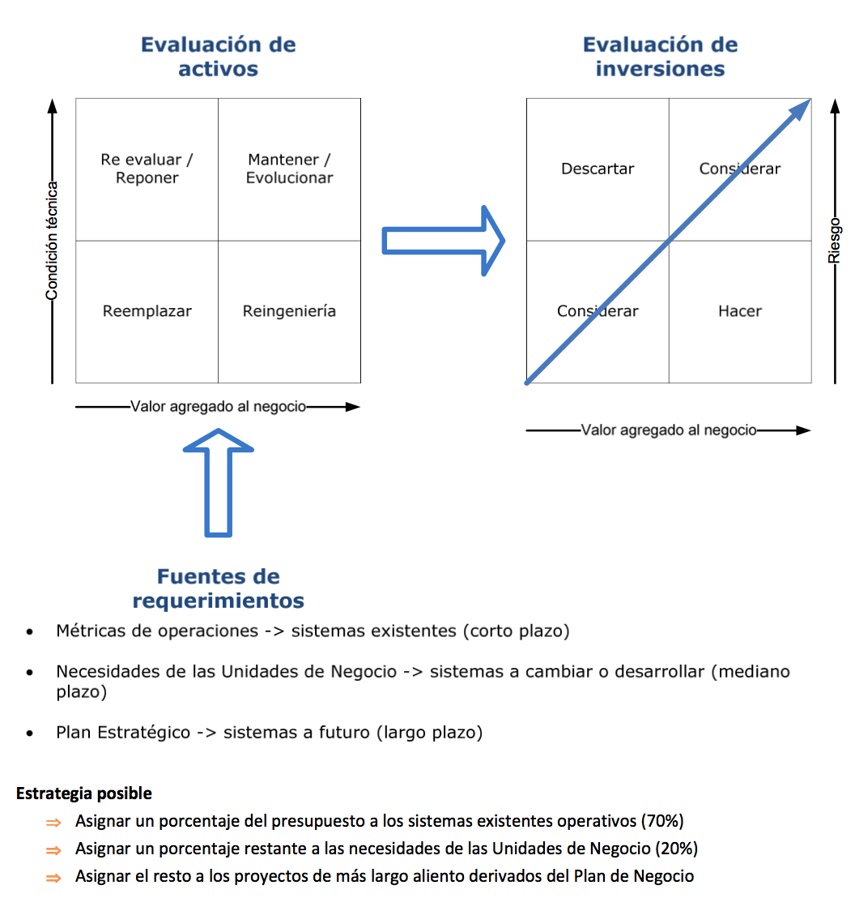

### 2. Fase de diseño

**Aspectos clave**

- Buen diseño de los servicios → Minimizar costo, mejorar calidad, consistencia, integración, escalamiento, eficiencia
- Administración del catalogo de servicios → Bien documentados
- Requerimientos → Escalabilidad a futuro, acuerdos
- Modelos de diseño → Necesidades, capacidad existente, demanda nueva, madurez, cultura
- Administración de la capacidad
    + Balancear el costo y los recursos necesarios
    + Balancear la capacidad y la demanda
- Administración de la disponibilidad → Percepción de la calidad del servicio prestado, asegurarla, dar soporte, medidas de mejora
- Administración del nivel de servicio (SLA) → Medidas, satisfacción del cliente, seguimiento
- Evaluación de herramientas
- Administración de la Continuidad del Negocio (ITSCM) → Planes de continuidad y recuperación, riesgos, mejoras
- Administración de la Seguridad de la Información
- Administración de Proveedores → Obtener valor agregado, acuerdos y contratos alineados, base de datos

### 3. Fase transición

**Aspectos clave**

- Planificación → coordinar recursos, administrar riesgos, *Proveer un plan claro que permita alinear las actividades de usuarios y negocio con los de
las tareas de transición de los servicios*
- Activos y administración de la configuración → Software, hardware, documentos, herramientas, configuraciones, etc.
- Administración de entregas e instalaciones → Disminuir costos de seguimientos de fallas, ambiente de confianza
- Administración de cambios
- Pruebas y validación → Ambientes de pruebas, cultura de pruebas, integración continua

**Beneficios**

- Permite mantener alineados los servicios provistos con los requerimientos del negocio y su operación
- Los proveedores pueden garantizar la puesta en funcionamiento de nuevo servicios minimizando as operaciones y su impacto sobre el negocio
- Seguridad en el proceso de puesta en funcionamiento a través de un proceso controlado

### 4. Fase operación

Fase de las **actividades y la infraestructura del día a día en la posición de los servicios** según el **SLA acordado.**

**Procesos**

- Administración de eventos → Todo lo que afecta a la infraestructura o provisión → Detección temprana
- Cumplimiento de solicitudes → Solicitudes que implican bajo costo, menor tiempo de resolución, bajo riesgo.
- Administración de incidentes → Evento que interrumpió o podría interrumpir un servicio → Aumentar la disponibilidad
- Administración de problemas → Causa desconocida de uno o más incidentes
- Administración de accesos → Permisos, seguridad de la información, confidencialidad, integridad → Minimizar abusos

**Funciones**

- Service Desk → **Función vital de la prestación de servicios** que se ocupa de **tomar todos los eventos que se generen por diferentes causas en el anormal funcionamiento de los servicios**, métricas
- Administración de infraestructura → Expertos en la administración de tecnología
- Administración de operaciones → tareas del día a día, para asegurar el SLA, infraestructura
- Administración de aplicaciones → Conocer las aplicaciones del negocio a lo largo de todo el ciclo de vida
- Monitoreo y control → Medir, informar, actuar. Realimentando la estrategia, el diseño y las pruebas. Reactivo y proactivo. Operacional y mejora continua.

### 5. Mejora continua

**Consiste en evaluar y mejorar la provisión de los servicios en la organización en los siguientes niveles:**

- Como una disciplina
- Con el alineamiento entre el portfolio de servicios de IT y las necesidades del negocio
- Con madurez para proveer los servicios de IT según el ciclo de vida definido.

**Propósito**

Optimizar el alineamiento entre las necesidades cambiantes del negocio y los servicios provistos que soporten los procesos de negocio. Lograr efectividad y eficiencia a buenos costos.

## Gobierno IT

### Nivel de decisión

**Principios de IT** → High-level decisions about the strategic role of IT in the business.

- ¿Cuál es el modelo operativo de la organización?
- ¿Cuál es el rol de IT en el negocio?
- ¿Cuál es el comportamiento deseable del negocio?
- ¿Cómo será soportada IT?

**Arquitectura de IT** → An integrated set of technical choices to guide the organization in satisfying business needs.

- ¿Cuáles son los procesos centrales del negocio? ¿Cómo están relacionados?
- ¿Qué información conducen estos procesos? ¿Cómo deben integrarse?
- ¿Qué capacidades tecnológicas deberían estandarizarse a través de la organización para hacer eficientes los procesos y facilitar la integración?
- ¿Qué criterio tecnológico guiará la iniciativa de IT?

**Infraestructura de IT** → Centrally coordinated, shared IT services providing the foundation for the enterprise’s IT capability and typically created before precise usage needs are known

- ¿Cuáles son los servicios de infraestructura críticos para lograr los objetivos?
- ¿Cuáles son los servicios y sus SLA? ¿Cuáles serán tercerizados?
- ¿Cómo serán sustentados los servicios necesarios?
- ¿Cuál es el plan para adaptar la tecnología?

**Aplicaciones de Negocio** → Business requirements for purchased or internally developed IT applications.

- ¿Cuáles son las oportunidades de negocio (mercado y procesos) para las
- nuevas aplicaciones de las diferentes UN?
- ¿Cómo fueron estimados sus posibles éxitos?
- ¿Cómo pueden ser insertas en la arquitectura organizacional? ¿Cuáles y por qué justifican excepciones?
- ¿Quién es el responsable de los proyectos que asegure el valor estimado?

**Inversiones de IT** → Decisions about how much and where to invest in IT, including project approval and justification techniques.

- ¿Cuáles son los procesos prioritarios de IT?
- ¿Cómo están tratados en el portafolio? ¿Son consistentes con los objetivos del negocio?
- ¿Cuál es la importancia relativa entre la inversión de la ORG y de la UN?
- ¿Las inversiones actuales reflejan esta relación?

### Arquetipos

- **Monarquía de Negocio** → A senior business executive or a group of senior executives, sometimes including the CIO
- **Monarquía de IT** → Individual or groups of IT executives.
- **Feudal** → Business unit or process leaders making separate decisions based on the needs of their entities.
- **Federal** → C-level executives and business representatives of all the operating groups—may include IT involvement (equivalent of the central government and the states working together).
- **Compartida/Duopolio** → Two party decision making involving IT executives and one group of business leaders.
- **Anarquía** → Each individual user or small group.
- **No conocida**

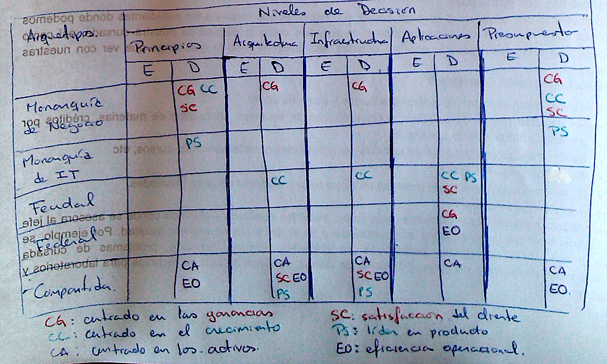

- E: Entrada
- D: Decisión

### Modelos operacionales

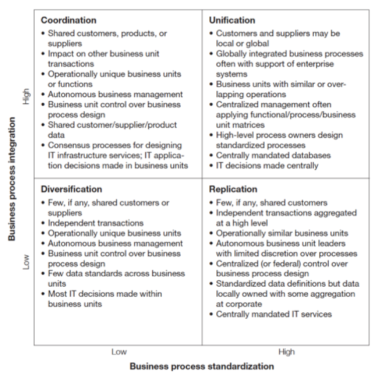

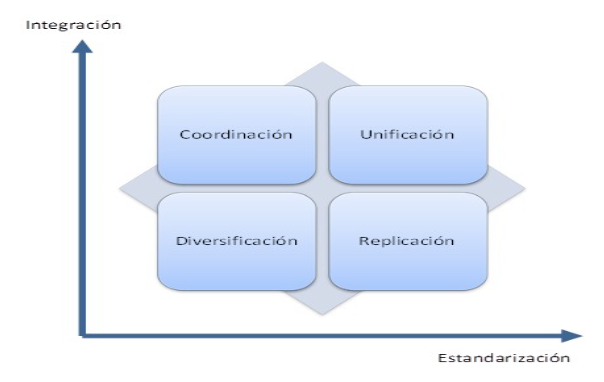

**Diversificación** → Baja estandarización, baja integración

Se usa cuando se comparten clientes, productos o proveedores entre BU, mientras que los procesos cuentan con operaciones únicas, a veces demandando capacidades únicas. Este tipo de organizaciones por lo general no buscan bajo costo, se tienen BU autónomas que ejecutan sus procesos de la forma más eficiente posible y los directivos corporativos se centra en proveer el mejor servicio a los clientes.

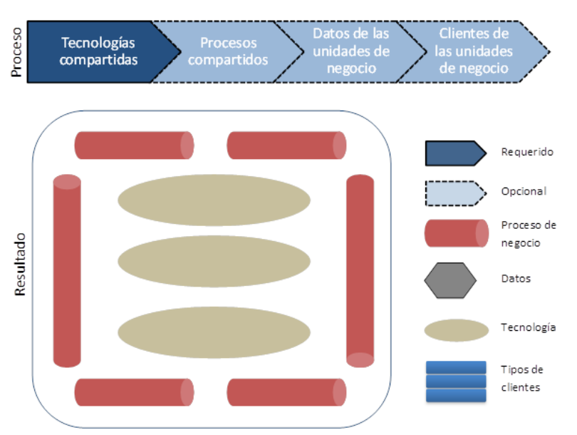

**Coordinación** → Baja estandarización, alta integración.

Se usa cuando se comparten clientes, productos o proveedores entre BU, mientras que los procesos cuentan con operaciones únicas, a veces demandando capacidades únicas. Este tipo de organizaciones por lo general no buscan bajo costo, se tienen BU autónomas que ejecutan sus procesos de la forma más eficiente posible y los directivos corporativos se centra en proveer el mejor servicio a los clientes.

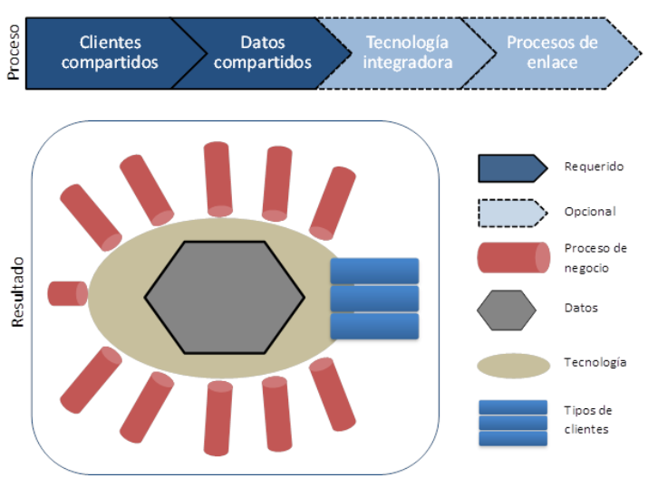

**Replicación** → Alta estandarización, baja integración.

Les dan autonomía a las BU y usan procesos muy estandarizados. En este tipo de modelo **el éxito de las organizaciones depende** de la eficiencia y procesos repetitivos antes que relaciones compartidas de clientes.

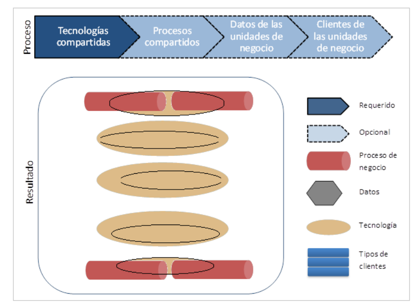

**Unificación** → alta estandarización, alta integración.

Les dan autonomía a las BU y usan procesos muy estandarizados. En este tipo de modelo el éxito de las organizaciones dependen de la eficiencia y procesos repetitivos antes que relaciones compartidas de clientes.

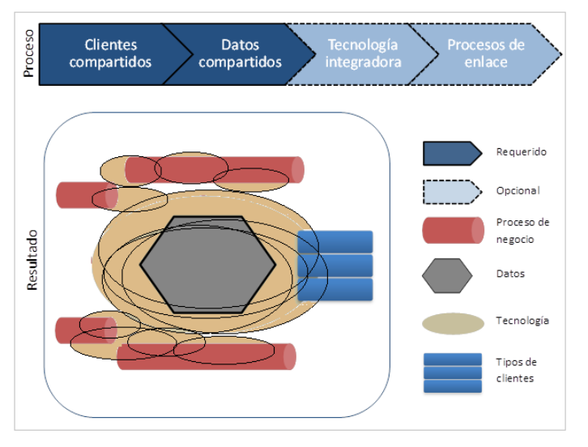

### Arquitectura - madurez

- **Silos de negocio** → las empresas buscan maximizar las necesidades de las unidades de negocio individuales o las necesidades funcionales. Se centra el foco de las inversiones de IT para obtener soluciones a problemas y oportunidades locales del negocio.
- **Tecnología estandarizada** → provee eficiencia de IT a través de tecnología estandarizada y la centralización de la gestión de la tecnología. El foco se desplaza de aplicaciones locales a infraestructura compartida.
- **Núcleo optimizado** → provee los datos y procesos estandarizados a través de la empresa adecuados para el modelo operacional. La visión local de los datos es desplazada por una visión a nivel empresa. Los datos se vuelven accesibles a todos los procesos necesarios y se elimina la redundancia de las aplicaciones individuales. Las inversiones pasan de aplicaciones locales y infraestructura compartida a datos compartidos y sistemas empresariales.
- **Modularización del negocio**  → facilita la agilidad estratégica a través de componentes adaptables o reusables. Estos módulos extienden la esencia del negocio construida en infraestructura en la etapa de núcleo optimizado. El rol de IT es proveer enlaces entre los distintos módulos de procesos de negocios.

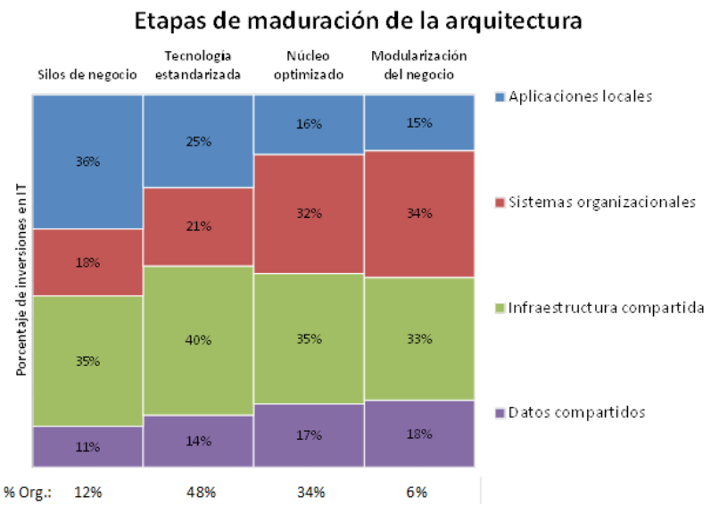

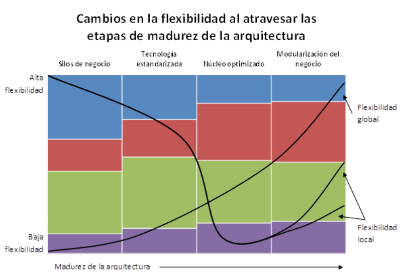


## Activos

### Especificación de requerimientos

- **Descripción general**
    + **Objetivos**
        * De esta etapa del proyecto
        * Del proyecto
    + **Documentos relacionados**
    + **Destinatarios**
    + **Participantes**
    + **Contexto**
        * Objetivos y estrategias del negocio
        * Sistema actual
        * Problemas actuales
    + **Descripción**
        * Descripción general del sistema a desarrollar
        * Beneficios esperados
    + **Alcance**
        * Funciones incluidas
        * Funciones excluidas
        * Interfaz con otros sistemas y/o dispositivos de hardware
- **Requerimientos**
    + Funcionales
    + Paquete i
    + Requerimientos no funcionales
    + Acuerdo
- **Actores**
    + Modelo de actores
    + Descripción de actores
- **Paquetes lógicos**
    + Modelo de paquetes lógicos
    + casos de uso preliminares de paquetes lógicos
    + Lista de casos de uso preliminares
    + Paquete i
- **Modelo de casos de uso**
    + Paquete i
        * Diagrama de casos de uso
        * Especificación de casos de uso
        * Interfaz
        * Modelo de dominio
- **Relaciones**
    + Matriz de realización de requerimientos - Casos de uso
- **Alternativas de solución**
    + Alternativa 1
    + Alternativa ..
- **Apéndice**
    + Estimación te tamaño de software
    + Análisis de riesgos
    + Glosario
    + Control de cambios

### Modelo de especificación de casos de uso

- **Diagrama de casos de uso**
- **Especificación de caso de uso**
- **ID_CASO: NOMBRE_CASO**
    + **Objetivo**
    + **Prototipo de interfaz**
    + **Especificación del caso de uso**
        * Actores
        * Precondiciones
        * Prioridad
        * **Flujo básico**
            - Nombre del flujo básico
            - Primer paso del flujo básico
            - Segundo paso del flujo básico
            - La información mostrada en la interfaz es:
                + Dato mostrado 1
                + Dato mostrado 2
                + ...
            - Tercer paso del flujo básico
            - El sistema responde mostrando una interfaz de entrada de los siguientes datos
                + Dato al ingresar 1
                + Datos al ingresar 2
                + ...
            - Cuarto paso del flujo básico
            - Quinto paso del flujo básico
            - El caso termina
        * **Flujos alternativos**
            - Nombre del flujo alternativo
            - Primer paso del flujo alternativo
            - Segundo paso
            - ....
        * **Postcondición**
        * **Requerimientos no funcionales**
        * **Diseño conceptual de interfaces**
        * **Control de cambios**

### Modelo de informe de avance

- Datos del reporte
- Grado de avance del proyecto
    + Observaciones
- Entregables
- Facturación
- Problemas surgidos
    + Problemas anteriores
    + Problemas nuevos
- Seguimiento de riesgos
    + Análisis de la evolución
    + Acciones
- Cambios de requerimientos acordados
- Monitoreo de acuerdos
- Monitoreo de involucramiento
- Monitoreo de hitos
- Monitores de administración de datos
- Acuerdo de avance

### Modelo de procedimiento

- Descripción
- Forma de trabajo?
- Condiciones de entrada
- Entradas
- Roles
- Activos
- Resumen de tareas
- Pasos del procedimiento
    + Tarea
    + Roles
    + Entrada
    + Salida
- Salida
- Condiciones de salida
- Métricas
- Verificación y validación
