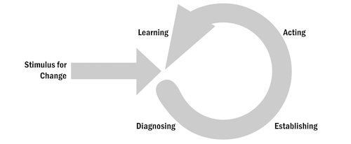
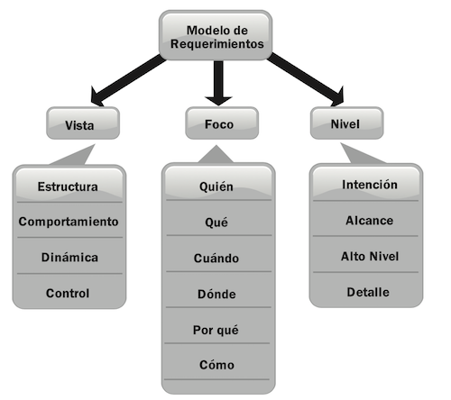
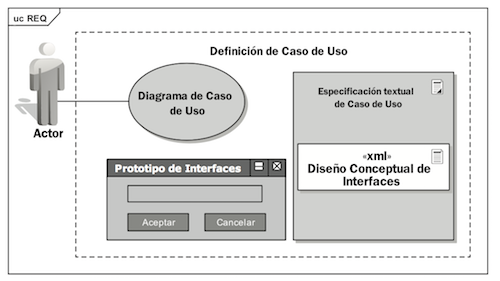
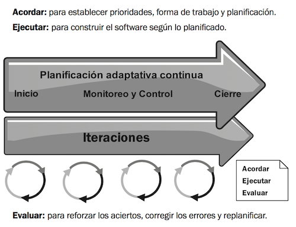
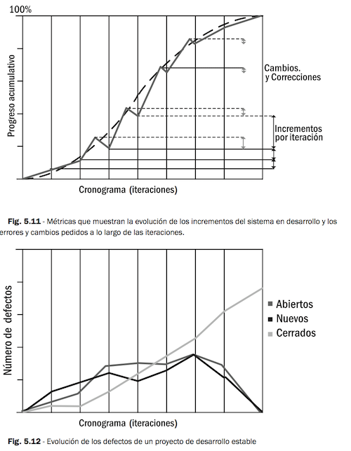

# Resumen calidad

## Capítulo 2 - Causas que deterioran la calidad en el software

```
- Calidad de producto → Si le sirve a quien lo adquiere (y lo usa para lo que fue concebido)  
- Calidad de proceso → Un proceso malo genera productos de mala calidad
```

1. Lograr el involucramiento en el proyecto de parte de los clientes y usuarios
2. Lograr el compromiso de nuestra propia organización (somos los desarrolladores) con el proyecto
3. Lograr un claro entendimiento de los requerimientos
4. Lograr una planificación realista
5. Trabajaremos en forma iterativa
6. Evaluando objetivos
7. Capacitando a nuestros miembros
8. Motivando a todos los involucrados
9. Haciendo visibles los objetivos
10. Enfocándonos en generar valor agregado con cada entrega 

#### Problemas

- Falta de involucración del **cliente**
- Falta del compromiso de **organización desarrolladora**
- Falta de un claro entendimiento de los **requerimientos**

Calidad → Interna + Externa

- Necesidades del cliente → surgen desde el negocio
- Requerimientos → El técnico evalúa las **necesidades** y saca información de ellas para transformar las necesidades en requerimientos → Se pueden medir → Pruebas de aceptación

```
Vista → Externa → Encuestas clientes
                → Pruebas de aceptación
          
      → Interna → Calidad de diseño
                → Calidad de código
                → Métricas
```

**Mejora continua** → Todo el tiempo buscar el punto de mejorar y hacer ciclos de revisión y mejora continua.

## Capítulo 3 - Trabajo con la organización - Mejora de procesos

### 3.1 Visión del cambio

#### ¿Cuáles son las causas por las cuales los responsables de las organizaciones deciden embarcarse en un proceso de mejora?

- Trabajar de una mejor manera para generar un ambiente de trabajo más valorado por sus miembros y captar así a los mejores profesionales al convertir a la empresa en un lugar deseado.
- Mejorar los procesos de desarrollo para mejorar la calidad de los productos generados y hacer a la empresa más competitiva, y como consecuencia de esto ganar una porción mayor del mercado.
- Ser beneficiados por incentivos legales instituidos por políticas públicas y lograr beneficios impositivos que favorezcan las finanzas de la organización. 


#### Preguntas que hay que hacerse

- **¿Qué hay que cambiar? → Evaluar la situación** ← Falta de consenso → Listar los problemas de la organización sin causas ni responsables.
- **¿Hacia dónde debe conducir el cambio? → Visión, estrategia, tácticas y buenos prácticas** ← Falta de consenso sobre la dirección, que funcione la solución, efectos no deseados → Listado de alternativas de cambio a los problemas, generar espacio de opinión
- **¿Cómo implementar el cambio? → Desarrollo de tácticas y planes, sincronización de esfuerzos, planeamiento y liderazgo** ← Falta de una clara visión, falta de confianza → Depende de la planificación técnica y de los recursos que se cuente

### 3.2 Trabajando en los cambios

#### Modelo IDEAL



Inicio → Diagnostico → Planificar → Actuar → Aprender

#### Modelo EOALG → Escuchar y observar a la gente

Presentar → EO → Compartir → EO → Inducir → EO → Guiar → EO → Evaluar → EO → Acomodar y cambiar → Comunicar

#### Fenómenos 

→ **Desconcierto** → Punto de inflexión en el cambio, se necesita apoyo para superarlo, sino se vuelve a la forma original, mala pero segura. Sugiere realización de proyectos piloto.  
→ **Proceso virtual** → Punto medio entre el proceso real y el nuevo proceso, producto de la dilatación en la implementación

### 3.3 Aspectos y factores del Proceso de mejoras

#### Direcciones del cambio

- Tácito → Explícito → Conocimiento privado en lugar de organizacional
- Informal → Formal → Habilidades particulares
- Episódico → Sustentable → Por algo particular en vez de buenas formas
- Individual → Organizacional → Capacitación personal en lugar del entorno
- Intuitivo → Empírico → Decisión por experiencia individual en lugar de la organización
- Cualitativo → Cuantitativo → Análisis informal en lugar de métricas
- Táctico → Estratégico → Planificar para hoy en lugar de a más largo plazo

#### Aspecto socio-cultural de la gestión del cambio

- Incrementar la capacidad de los empleados y de la organización.
- Asegurar que la calidad sea un atributo organizacional.
- Alinear los intereses de los individuos con los de la organización.
- Retener recursos humanos y conocimiento críticos para la organización.

#### Factores críticos y de riesgo

- Procesos previos de mejora fracasados → +esfuerzo
- Recursos financieros disponibles → +esfuerzo, no factibilidad
- Recursos humanos dedicados al proceso → Son necesarios
- Capacidad de ingeniería de software → -conocimiento +capacitación
- Disponibilidad de soporte técnico → Es necesario
- Obligaciones contractuales → Condicionan las pruebas piloto
- Alcance de la intervención → +claro -confusión
- Cultura de la organización → Condiciona el proyecto
- Estándares de la industria y la organización → Condiciona el proyecto
- Comprensión y apoyo de todos los niveles de gerencia y desarrollo. → Sin gerencia, no comenzar
- Presión política de la corporación → +Planificación realista, no ceder
- Objetivos de negocio → Hay que tenerlos en cuenta, visión 
- Visión → Preguntarse ¿Por qué? para descubrirla y darle forma

#### Factores generales de éxito

- Expectativas realistas → Evita pasarse del alcance
- Apoyo de la gerencia → Compromiso y soporte
- Necesidades y expectativas gerenciales, y la comprensión del problema → Facilita y evita conflictos
- Grupo de Ingeniería de Procesos de Software (con un “campeón” del cambio). → Ámbito donde se general los cambios
- Comenzar poco después de una evaluación → Evita procesos virtuales
- Capacitar a todos de los nuevos procesos → Esencial
- Gestión de la dimensión humana → Evita el rechazo
- Selección cuidadosa de proyectos piloto → No afectar proyectos críticos que culpen a la mejora
- Auditorías de proceso en la implementación → Corregir y acompañar
- Encuestas de efectividad de los equipos de trabajo → Retroalimentación
- Comenzar con los ajustes gerenciales más altos → Genera confianza
- Tener acompañamiento de expertos en cambio organizacional → En general no hay
- Mejoras y objetivos de negocios cerca  →  Logra aprobación de marketing y comercial
- Vocabulario compartido → Identidad al proceso de cambio

#### Factores de éxito en PYMES
 
- Adaptarse a las características de la empresa → Si no es acorde, fracasa
- Facilitar el aprendizaje horizontal con la experiencia de otras pequeñas empresas → Potencia recursos, aprovecha esfuerzos
- Necesidad de acompañamiento → No afectar los procesos actuales por falta de personal
- Claridad en el financiamiento → Tener claro el alcance financiero

#### Recomendaciones

- No buscar una certificación como un fin sino como consecuencia
- Compromiso total con la objetividad, la racionalidad y el aprendizaje
- Adecuarse a las características de la empresa (tamaño, cultura, estructura, tipo de negocio)
- Encuadrar la estrategia global de negocios
- Acompañamiento como apoyo a la gestión de cambio y riesgo incremental 

### 3.4 Gestión del cambio

#### Oposición al cambio → Emergentes, positivos

- Las organizaciones están compuestas por personas, por lo tanto son organizaciones vivas.
- Los seres vivos no cambian, reaccionan.
- Detectar los emergentes en estas reacciones e interpretar su visión.
- Alinear los intereses emergentes con los del proceso de cambio. 

#### Cultura organizacional

Estructura → Claves → Objetivos → Comportamiento ante cambios → Ejemplo

- **Jerárquica** → Reglas y rutinas formales → Estabilidad y control → Cumplimiento de procedimientos → Resistencia status quo → Estructura militar, desarrollo con mezcla de tareas operativas y de desarrollo
- **Racionalista** → Basada en la capacitación → Productividad y eficiencia → Seguimiento de objetivos → Abierta a cambios por objetivos → Software factory, modelo CMMi
- **Consensual** → Basada en la colaboración grupal  → Cohesión y moral  →  Mantenimiento del grupo → Abierta a cambios → Org. no gubernamentales sin fines de lucro (fuera de SW)
- **Desarrollo Humano** → Basada en la colaboración grupal → Flexibilidad, centrado en la gente → Crecimiento y desarrollo de los miembros → Cambios naturales → Comunidades científicas

#### Estrategia

- Acordar visión y objetivos con la autoridad  → sin ella es imposible dar directivas
- Crear canales de comunicación y comunicar
- Detectar liderazgo y alinear con el cambio
- Convertir la reacción en Emergentes y utilizarla en la Planificación
- Detectar problemas, que cambiar y como implementar cambios

#### Tácticas

- Detectar agentes de cambio y trabajar con ellos
- Seleccionar temas puntuales. Trabajar en forma incremental
- Rescatar lo bueno, bien hecho y conservarlo como parte de la mejora
- Fundamentar los cambios y mostrar resultados con frecuencia

#### Liderazgo

- Un lider no es aquel que enseña, sino que muestra el camino sin saberlo y motiva
- Una organización necesita líderes en todas sus áreas
- Debe formar parte de la cultura la delegación 
- Debe formar parte de la cultura la asunción de responsabilidades

## Capítulo 4 - Trabajo con requerimientos

### 4.1 Importancia de los requerimientos

#### Rol del analista

Doble interfaz

- **Interfaz de Negocio**  → técnicas de relevamiento, UML (actividad, estado y secuencia) y documentación de proceso de negocio
- **Interfaz de Desarrollo**  → interfaz entre clientes y usuarios al grupo de desarrollo, UML (clases, casos de uso y paquetes), modelo de dominio y arquitectura de sistemas

#### ¿Qué son los requerimientos?

- Definen lo que un sistema permite hacer desde el punto de vista del usuario
(funcionales)
- Definen condiciones de funcionamiento del sistema en el ambiente operacional (no funcionales)
- Definen las condiciones a cumplir durante el desarrollo (de proceso).

Definir el sistema a desarrollar → Comunicar y acordar el alcance y las prioridades → Planear el proyecto de desarrollo

Los requerimientos deben describir el sistema que los clientes y usuarios necesitan, por eso hay que **_validarlos_**.

### 4.2 Tareas asociadas a los requerimientos

#### Foco



- La visión del proyecto **(por qué)**
- La inclusión del vínculo de todos los involucrados en el negocio **(quién)**
- El alcance del sistema a desarrollar **(qué)**
- Las condiciones del ambiente operacional **(dónde)**
- El comportamiento funcional esperado **(cómo)**
- Los eventos del negocio **(cuándo)**

#### Nivel

Determina el detalle que son tratados los aspectos. Depende del ciclo de vida

#### Vista

Depende de los modelos que se utilicen

- Estructura (modelo de dominio)
- Dinámica (diagramas de secuencia)
- Comportamiento (diagramas de casos de uso)
- Control (reglas de negocio, modelo de análisis)

**Es fundamental relevar los requerimientos desde los distintos enfoques (FOCO) construyendo los distintos modelos (VISTAS) y trabajando según el ciclo de vida del proyecto (NIVEL).**

### 4.3 Estrategia y tácticas en el trabajo con requerimientos

#### Estrategia

Planear → Hacer → Revisar → Corregir

#### Tácticas

Los requerimientos deben cumplir con

- Completitud
- Correctitud
- No ambigüedad

#### Casos de uso

Describe la dinámica entre un actor y como responde el sistema



### 4.4 Análisis de requerimientos

#### Dominio y Negocio vs Diseño

→ Objetivo → Mecanismo utilizado

**Modelo de Negocio** → Entender en detalle el negocio y sus reglas → Patrones de análisis

**Diseño** → Implementar una solución al problema planteado en el análisis más las restricciones impuestas por los requerimientos no funcionales → Patrones de diseño

### 4.5 Validación y Verificación

**Validación** → Programación definitivo o prototipo y ejecutar las validaciones de las reglas de negocio. Validación del comportamiento de la aplicación con los usuarios según caso de uso.

**Verificación** → Diseño y ejecución de pruebas (test) que darán la certeza que hemos construido el sistema de manera correcta. 

### 4.6 Administración de cambios a los requerimientos

- Gestionar los cambios
- Que tratamientos les daremos a esos cambios

#### 4.7 Conclusiones

De lo expuesto se concluye que el trabajo con los requerimientos es mucho más que relevar y listar los “el sistema debe...” de todo proyecto de desarrollo.

Es de primera importancia planificar el trabajo con los requerimientos.

Es fundamental relevar los requerimientos desde los diferentes enfoques (Foco), construyendo los diferentes modelos (Vistas) y trabajando según el momento del ciclo de vida del proyecto (Nivel).

Es necesario que el listado cuente con determinadas propiedades (detallado, atómico, completo, correcto, no ambiguo) para no ser solo un listado de características.

Se debe, a partir de la especificación del comportamiento de la aplicación a desarrollar (casos de uso), definir cómo se implementarán estos requerimientos.

Es necesario contar con un modelo de dominio que siente las bases para un posterior diseño y que esencialmente describa al negocio.

En todos los casos, administrar los cambios surgidos durante el proceso de desarrollo.

Por último debemos validar y verificar todo este trabajo con los requerimientos.

## 5. Trabajo con la gestión de proyectos

### 5.1 Proyectos



### 5.2 Planificación de proyectos

#### Estrategia

Metodología no es estrategia

- Logro de objetivos
- Implementar los requerimientos priorizados
- Orientada a evitar/sobrepasar los obstáculos (riesgos)

- Objetivos a partir de la visión → Financiera, cliente usuarios
- Conocer los riesgos → Detectarlos, gestión
- Entender la solución y alcance → Requerimientos, Listar/priorizar casos de uso
- Estimar → Casos de uso, interfaces con sistemas externos, Reportes
- Definir procesos → Metodología, Roles
- Cronograma priorizado -> Hitos, relaciones

#### Riesgos

- **Requerimientos** → Complejidad y falta de disponibilidad
- **Tecnología** → Falta de experiencia o madurez
- **Organización** →  Falta de apoyo de la gerencia
- **Cliente** → Falta de experiencia en proyectos de desarrollo
- **Grupos de desarrollo** → Grupos nuevos sin trabajos anteriores

#### Estimaciones

De alcance y esfuerzo

- Las estimaciones teóricas deben ser ajustadas a la realidad del proyecto
- Las planificaciones no pueden acortarse sumando gente a los proyecto

### 5.3 Seguimiento del desarrollo de proyectos

#### Líder de proyecto

1. Generar en tiempo y forma los eventos planificados
2. Facilitar los acuerdos necesarios
3. Tomar decisiones

**Sí**

- Cohesión en el grupo
- Necesidades personales
- Facilitar la planificación
- Decisiones apoyado en referentes técnicos
- Informado y actualizado sobre la tecnología
- Tomar decisión en caso de desacuerdo
- Motivar y comprometer a los usuarios y clientes
- Escalar problemas

**No**

- Competir
- Ignorar tecnología
- Desatender el proyecto por cuestiones corporativas
- Olvidar que los desarrolladores son lo + importante
- Olvidar que hay que entregar un producto funcionado
- Temer parar cuando la factibilidad esté cuestionada

#### Puntos de observación

Para informar el estado y avance y tomar decisiones al respecto.

Fotos versus película
→ Tratamiento de una decena de tema
→ No seguimiento de los temas tratados

#### Escalamiento

- Roles predefinidos y asumidos
- Gerentes muy bien informados acerco de los proyectos

#### Métricas

- Progreso acumulado vs Cronograma, iteraciones → Al variar las correcciones y los requerimientos, creciendo y luego decreciendo, es un indicador de la evolución **estable** del proyecto.
- Relación entre errores detectados y corregidos



Otro grupo: GQM (Goal-Question-Metric). Preguntas al negocio para obtener una métrica 

Distintas métricas según fase

- Adherencia → Incorporación y cumplimiento de procesos y procedimientos
- Estabilidad → Para tomar acciones aque ayuden a mantenerla
- Capacidad → Una Cubrimiento de los objetivos
- Comportamiento → Eficiencia y eficacia
- Mejora → Para mejora continua

### 5.4 Conclusión

A efectos de lograr una buena gestión de los proyectos de desarrollo de software de forma que generen productos de calidad se debe:

- Elaborar una estrategia en base a los objetivos, prioridades y riesgos
- Volcar en una planificación los esfuerzos estimados según la estrategia
- Realizar el seguimiento resolviendo los problemas que se generen y escalando los que excedan nuestras responsabilidades
- Detenerse ante los problemas y no continuar hasta resolverlos
- Explicar cada decisión y comunicarla a todos los involucrados
- Tomar métricas que nos provean indicadores de la evolución de los proyectos de alineados a los objetivos del negocio y a los procesos de nidos para la organización

## Capítulo 6 - Trabajo con la Implementación. Diseño, codificación y pruebas

### 6.1 Diseño, codificación y pruebas

**Problemas**

- Proceso de Diseño → Revisión de los diseños con pares y otros miembros. Búsqueda de que revisar
- Construcción → Pruebas unitarios y de integración es costosa. Buscar automatización, también búsqueda de que revisar
- Pruebas → Realizar pruebas no contribuye a la mejora de calidad, sino solo a detectar errores, se necesita una acción constructiva global

### 6.2 Pruebas de software

Cambiar la forma de trabajo con pruebas porque:

- El ciclo de prueba manual es muy largo
- El proceso de prueba manual es propenso a errores
- Liberar a la gente para realizar tareas creativas
- Generar un ambiente de confianza soportado por los test
- Obtener realimentación de forma temprana y con alta frecuencia
- Generar conocimiento del sistema en desarrollo a partir de los test
- Generar documentación consistente del código
- Generar una mejor utilización de los recursos a partir de menores costos
- Desarrollar un criterio de diseño basado en las pruebas

**Necesitamos**

- Automatizar y sistematizar las pruebas
- Desarrollar un criterio de diseño basado en las pruebas

### Repositorio

- Haga commit con frecuencia
- Construya binarios con cada cambio
- No tome del repositorio (checkout) a su estación de trabajo código no funciona
- Escriba test unitarios sistemáticos para el código que desarrolla
- Antes de subir al repositorio (check in) el código desarrollado y todos los tests (suyos y los de los otros desarrolladores) deben ser ejecutados con éxito
- Corrija los errores (tests sin funcionar) que su código generó en forma inmediata


